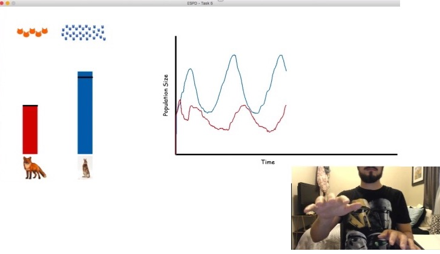

```{r setup, include=FALSE}
knitr::opts_chunk$set(echo = FALSE, cache = TRUE)
setwd("~/Dropbox (Personal)/Dissertation/Python Files")

# load packages and core clusters
library(dplyr)
library(depmixS4)
library(TraMineR)
library(knitr)
library(parallel)
library(jpeg)

bindToEnv <- function(bindTargetEnv=parent.frame(), objNames,doNotRebind=c()) {
  # Bind the values into environment
  # and switch any functions to this environment!
  for (var in objNames) {
    val <- get(var,envir = parent.frame())
    if (is.function(val) && (!(var %in% doNotRebind))) {
      # replace function's lexical environment with our target (DANGEROUS)
      environment(val) <- bindTargetEnv
    }
    # assign object to target environment, only after any possible alteration
    assign(var,val,envir = bindTargetEnv)
  } 
}

myCores = makeCluster(detectCores())
```

## Summary
This brief paper summarizes my analysis of hand data extracted from the ESPD. The ESPD is an instructional system that cues the movement of the hands to create embodied represenations of nonlinear dynamics of a predator-prey ecosystem (see Figure 1).  


  
The goal of the analysis is to determine how closely the student is able to enact the elicited movement. In other words, the question is: Can we use some quantitative features of the student hand movements, as collected in the ESPD log data, to measure how close are these movements to the computer elicited movement? 
  
Data are from two sources, the automated/elicited movement of predator and prey populations, and the student/enacted movement of both hands. The data is measured in pixels, and smaller values represent the hand being higher, and, conversely, larger values represent the hand being lower.  

The analysis consists of four phases: (1) preprocessing, (2) state sequence modeling, (3) posterior estimation of state sequences, and (4) sequence similarity calculation. First, the hand position values are normalized and velocity values are computed. Velocity values are the difference between hand position at time *t* and *t* - 1. Second, a training phase takes place in which a Hidden Markov Model (HMM) is fit to the elicited data using the velocity values. Third, a prediction phase takes place where the HMM is used to estimate the sequence of states from the enacted movement. Finally, an Optimal Matching algorithm is used to compute the distance between the elicited and enacted sequences.

## 1. Preprocessing
The ESPD log captures the position of the hands and the markers (the automated horizontal bars used in cuing student movement of the hands). Table 1 shows the first 6 observations of the ESPD raw data. 
```{r load}
dat = read.csv("Student_Files/S001_task005.csv") %>% transmute(left_mark = mark_left,
                                                               right_mark = mark_right,
                                                               left_hand = left_hand,
                                                               right_hand = right_hand)
head(dat) %>% round %>% kable(caption = "ESPD raw data", format = "latex", align = "c")

dat2 = read.csv("Student_Files/S002_task005.csv")
hand2 = dat2 %>% transmute(norm_left_hand = 1 - (left_hand / max(left_hand)),
                         norm_right_hand = 1 - (right_hand / max(right_hand)))
```

### 1.1. Normalization
The raw data in the form of position values are first normalized dividing each value over the maximum position value and subtracting from 1 (to make large values up and small values down). Figure 2 plots the movement of the automated markers and the movement of the hands using the normalized values for two students. It can be seen Student's 2 enacted movement was not as good as that of Student 1.  

```{r normalization, echo=TRUE}
# normalize data
hand = dat %>% transmute(norm_left_hand = 1 - (left_hand / max(left_hand)),
                         norm_right_hand = 1 - (right_hand / max(right_hand)))
```
```{r normalization2, fig.width=10, fig.height=4, fig.cap="\\label{fig:figs}(a) Computer elicited movement, (b) Student 1 enacted movement, and (c) Student 2 enacted movement."}
compu = dat %>% transmute(pred = 1 - (mark_right / max(mark_right)),
                          prey = 1 - (mark_left / max(mark_left)))

par(mfrow = c(1, 3))
plot(c(1, nrow(compu)/2), range(compu), type = "n", sub = "(a)",
     xlab = "time", ylab = "Normalized Height")
points(compu$prey %>% ts, type = "l", col = "blue")
points(compu$pred %>% ts, type = "l", col = "red")
plot(c(1, nrow(hand)), range(hand), type = "n", sub = "(b)",
     xlab = "time", ylab = "Normalized Height")
points(hand$norm_right_hand %>% ts, type = "l", col = "blue")
points(hand$norm_left_hand %>% ts, type = "l", col = "red")
plot(c(1, nrow(hand2)), range(hand2), type = "n", sub = "(c)",
     xlab = "time", ylab = "Normalized Height")
points(hand2$norm_right_hand %>% ts, type = "l", col = "blue")
points(hand2$norm_left_hand %>% ts, type = "l", col = "red")
```

### 1.2. Velocity  
The velocity of the movement is calculated by taking the difference between consecutive data points. Notice this operation results in real values (positive and negative), and thus the sign indicates the direction of the movement. Table 2 shows the results of this calculation for Student 1. 

```{r velocity, echo=TRUE}
# compute velocity
hand_vel = with(hand, {
  data.frame(vel_left_hand = sapply(2:length(norm_left_hand),
                               function(i) norm_left_hand[i] - norm_left_hand[i - 1]),
             vel_right_hand = sapply(2:length(norm_right_hand),
                                     function(i)
                                       norm_right_hand[i] - norm_right_hand[i - 1]))
})
```
```{r velocity2}
compu_vel = with(compu, {
  data.frame(vel_pred = sapply(2:length(pred), function(i) pred[i] - pred[i - 1]),
             vel_prey = sapply(2:length(prey), function(i) prey[i] - prey[i - 1]))
})

hand_vel2 = with(hand2, {
  data.frame(vel_left_hand = sapply(2:length(norm_left_hand),
                               function(i) norm_left_hand[i] - norm_left_hand[i - 1]),
             vel_right_hand = sapply(2:length(norm_right_hand),
                                     function(i)
                                       norm_right_hand[i] - norm_right_hand[i - 1]))
})

data.frame(dat[-1, ] %>% dplyr::select(contains("hand")) %>% round, 
           hand[-1, ], hand_vel) %>%
  round(3) %>% head %>%
  kable(caption = "Normalization and Velocity Calculation", 
        format = "latex", align = "c", row.names = F)
```

## 2. State Sequence Modeling 
To describe the characteristic pattern of the movement of the two hands, ten HMM models are fitted to the elicited data. The depmixS4 package is loaded and a loop is ran to iterate the fitting of the model over an increasing number of latent states: *k* = 5, ..., 15. To select the best model, the Bayesian Information Criterion (BIC) is used. The lower the BIC, the better the model fits to the data. Table 3 shows the model selection results. 

```{r modelSelection, include=FALSE}
# define worker functions
getFit <- function(k, dat) {
  dat.hhm = depmixS4::depmix(list(vel_pred~1, vel_prey~1), 
                             data = dat,
                             nstates = k,
                             family = list(gaussian(), gaussian()))
  cat('--Fitting model with', k, 'latent states--\n')
  model = depmixS4::fit(object = dat.hhm)
  c(k, AIC(model), BIC(model))
}

parWorker <- function() {
  bindToEnv(objNames = c("compu_vel", "getFit"))
  function(k) {
    print(paste('--Fitting model with', k, 'latent states--\n'))
    getFit(k, compu_vel[1:600, ])
  }
}

# run parallel analysis to find better fit
set.seed(80537)
fit = parSapply(myCores, 5:15, parWorker()) %>% t
colnames(fit) = c('k', 'AIC', 'BIC')

k.best = fit[which.min(fit[, 3]), 1]
k.best
best.bic = fit[which.min(fit[, 3]), 3] %>% round %>% as.character

dat.hhm = depmix(list(vel_pred~1, vel_prey~1), 
                           data = compu_vel[1:600, ],
                           nstates = k.best,
                           family = list(gaussian(), gaussian()))
set.seed(80537)
model = fit(dat.hhm)
responses = summary(model)
```

According to Table 4, the best models is a `r k.best`-state model because it has the lowest BIC = `r best.bic`. Details of this model's mixture parameters are shown in Table 5. An interpretation of the latent states is given by the sign and magnitude of the mean velocity of the hands. For instance, State 1 shows a kind of gesture where both hands (*mean_left_vel* and *mean_right_vel*) move down, but the right hand moves twice as fast as the left. State 2 shows a gesture where the left hand moves down and the right hand moves up three times faster than the left.

```{r paramTable, cache=FALSE}
fit %>% kable(caption = "HMM Model Selection", digits = 2, format = "latex", align = "c")

colnames(responses) = c("mean_left_vel", "sd_left_vel", "mean_right_vel", "sd_right_vel")
responses %>% kable(caption = "Model Parameters", format = "latex", align = "c")
```

## 3. Sequence Similarity Calculation
The next step is to use the model parameters to predict the latent states. Using the hand velocity and the model parameters, the posterior probability is calculated and a sequence of states is inferred for the enacted movement. Table 5 shows the first six entries for Student 1. Figure 3 shows the elicited and two enacted sequences.

```{r seqPostPar, include=FALSE}
predictStateSequence <- function(newdata, k = k.best, priormodel) {
    newModel = depmix(list(vel_pred~1, vel_prey~1), 
                  data = newdata,
                  nstates = k,
                  ntimes = rep(nrow(compu_vel), 3),
                  family = list(gaussian(), gaussian()))
    newModel = setpars(newModel, getpars(priormodel))
    set.seed(80537)
    newModel %>% 
      fit(verbose = FALSE) %>% 
      posterior %>% .$state
}

# predElictStates = predictStateSequence(newdata = compu_vel, priormodel = model)
```

```{r seqPost, echo=TRUE}
# fit enacted data by using the HMM model parameters
hmm.data = rbind(compu_vel,
                 data.frame(vel_pred = hand_vel[,1], vel_prey = hand_vel[,2]),
                 data.frame(vel_pred = hand_vel2[,1], vel_prey = hand_vel2[,2]))
predStates = predictStateSequence(newdata = hmm.data, 
                                       priormodel = model)
```

```{r seqTable}
data.frame(hand_vel[1:6, ], 
           State = predStates[nrow(hand_vel):nrow(hand_vel) + 6]) %>% 
  kable(caption = "Predicted States", digits = 4, format = "latex", align = "c")
```

```{r seq, echo=FALSE, include=FALSE, results=FALSE}
# enacted.data2 = data.frame(vel_pred = hand_vel2[, 1], vel_prey = hand_vel2[, 2])
# predEnactStates2 = predictStateSequence(newdata = enacted.data2, priormodel = model)
seqdat = predStates %>% matrix(nrow = 3, byrow = T) %>% seqdef
```
```{r seqPlot, fig.cap="(1) Elicited, (2) Student 1, and (3) Student 2 enacted Sequences", fig.height=4, fig.width=10}
seqplot(seqdat[, 1:nrow(compu)/2], 
        border = NA, xtlab = "", ylab = NA, with.legend = "right")
```

## 4. Sequence Similarity Calculation
```{r OM, echo=TRUE, results=FALSE}
# compute indel and substitution costs from transition rates
costs = seqcost(seqdat[1, ], method = "TRATE")

# compute similarity values
disVal = seqdist(seqdat, method = "OM", sm = costs$sm, indel = costs$indel, )
```

To compute the number of transformations required to convert the enacted sequence into the elicited sequence, an Optimal Matching algorithm is used. *Indel* costs are set to 1 and *Substitution* costs are set equal to the HMM transition rates. Larger values imply less similar sequences and, conversely, smaller values imply more similar sequences. The cost of transforming Student's 1 enacted sequence into the elictied sequence is d = `r disVal[1, 2] %>% round` (see Table 6). The value of transforming Student's 2 enacted sequence is d = `r disVal[1, 3] %>% round`. It can be seen transforming this latter sequence is more costly than that of Student 1. This means the distance values provide information as to how well a student is able to coordinate their hands to enact the computer-elicited movement.

```{r disVal}
colnames(disVal) = c("Elicited", "Student1", "Student2")
rownames(disVal) = colnames(disVal)
disVal %>% kable(caption = "OM Distance Values", 
                 format = "latex", align = "c", digits = 0)
```

## Conclusion
The above procedure can be regarded as a statistical measurement model of how well student enacted gestures are aligned with the computer elicited gestures. The information from this measurement model can help to make predictions about student learning gains. This predictive method can be implemented to support the personalization of the instructional system.